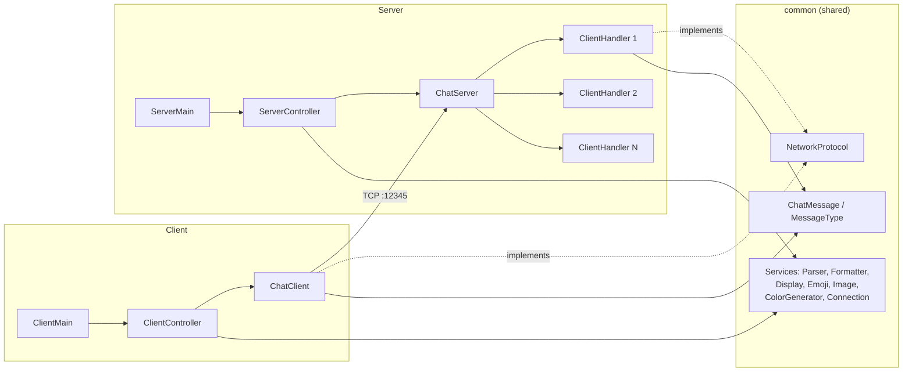

# JavaFX Chat — client/server messaging over TCP sockets

A desktop chat application in two parts: a multi-client server and a JavaFX
client, talking over raw TCP sockets. Supports text, emojis and image sharing.

---

## Overview

The project is an exercise in network programming and interface segregation.
Rather than putting socket handling inside the UI controllers, every capability
sits behind a small interface in `common.interfaces`, and the concrete services
in `common.services` implement them. The client and the server share that
`common` package, so the wire format is defined once.

The server accepts an arbitrary number of clients, giving each one a dedicated
`ClientHandler` thread, and broadcasts every incoming message to the others.

---

## Tech stack


| Component | Version |
|---|---|
| Java | 17 |
| JavaFX Controls & FXML | 17.0.14 |
| ControlsFX | 11.2.1 |
| FormsFX | 11.6.0 |
| BootstrapFX | 0.4.0 |
| JUnit Jupiter | 5.12.1 |
| Build | Maven + `javafx-maven-plugin` 0.0.8 |

Transport is `java.net.Socket` — no messaging framework involved.

---

## Architecture



### Shared contracts

| Interface | Responsibility |
|---|---|
| `NetworkProtocol` | Send, receive, close, connection state |
| `IMessageSender` | Outbound message emission |
| `IMessageReceiver` | Inbound message reception |
| `IMessageBroadcaster` | Fan-out to every connected client |
| `IDisplayService` | Rendering a message in the interface |

---

## Features

- Multi-client chat — one thread per connected client, server-side
- Text messages with a per-user colour assigned by `ColorGenerator`
- Emoji picker (`EmojiPicker`, `EmojiTextFormatter`) with a bundled set of PNGs
- Image sharing through a native file chooser (`FileChooserService`, `ImageService`)
- Typed messages (`MessageType`) so the receiver knows how to render them
- Explicit resource cleanup on disconnect (`ResourceCleanup`)
- Server window showing connection activity

---

## Prerequisites

| Tool | Version |
|---|---|
| JDK | 17 or later |
| Maven | 3.8 or later |
| JavaFX SDK | 17.0.14 — only needed for the packaged-run path below |

```bash
java -version
mvn -version
```

---

## Running locally

```bash
git clone https://github.com/NABIHAyman/javafxClientServerCommunication.git
cd javafxClientServerCommunication
mvn clean compile
```

**Start the server first** — the client fails to connect otherwise:

```bash
mvn javafx:run -Djavafx.mainClass=server.s.ServerMain
```

Then, in a second terminal, start a client:

```bash
mvn javafx:run
```

`client.c.ClientMain` is the plugin's default main class, so no argument is
needed. Launch the command again in more terminals to add clients.

> The `javafx-maven-plugin` is configured to read the `JAVAFX_HOME` environment
> variable, pointing at the `lib` folder of a JavaFX SDK. Set it if the run
> fails on a missing module:
>
> ```bash
> export JAVAFX_HOME=/path/to/javafx-sdk-17.0.14/lib
> ```

### Configuration

Constants live in `common/config/AppConfig.java`:

| Constant | Value | Role |
|---|---|---|
| `SERVER_PORT` | `12345` | TCP port the server listens on |
| `IMAGE_WIDTH` | `300` | Display width of shared images, in pixels |
| `IMAGE_HEIGHT` | `300` | Display height of shared images, in pixels |

Both client and server read the same file, so changing the port means
recompiling both.

---

## Project structure

```
javafxClientServerCommunication/
├── pom.xml
└── src/main/
    ├── java/
    │   ├── client/c/
    │   │   ├── ClientMain.java        # JavaFX entry point, client
    │   │   ├── ClientController.java  # FXML controller
    │   │   └── ChatClient.java        # Socket, NetworkProtocol implementation
    │   ├── server/s/
    │   │   ├── ServerMain.java        # JavaFX entry point, server
    │   │   ├── ServerController.java  # FXML controller
    │   │   ├── ChatServer.java        # Accept loop, broadcasting
    │   │   └── ClientHandler.java     # One thread per connected client
    │   └── common/
    │       ├── config/AppConfig.java  # Shared constants
    │       ├── interfaces/            # NetworkProtocol, IMessageSender,
    │       │                          #   IMessageReceiver, IMessageBroadcaster,
    │       │                          #   IDisplayService
    │       ├── model/                 # ChatMessage, MessageType
    │       ├── services/              # Parser, Formatter, Display, Emoji,
    │       │                          #   Image, FileChooser, ColorGenerator,
    │       │                          #   ConnectionManager, ResourceCleanup
    │       └── ui/                    # EmojiPicker, EmojiTextFormatter
    └── resources/
        ├── emojis/                    # Emoji PNGs
        └── server/chat/demo/          # FXML layouts and CSS
```

---

## Screenshots

> *To be added.* Planned slots: server window with clients connected, client
> conversation with coloured messages, emoji picker open, shared image in the
> thread.

```
docs/screenshots/
├── server.png
├── client.png
├── emoji-picker.png
└── image-sharing.png
```

---

## Status

**Academic project**, built in 2025. It is a teaching exercise on TCP sockets,
threading and JavaFX, not a messaging product: there is no authentication, no
encryption in transit, no message persistence, and no automated tests. The
server is meant to run on a local network.

---

## License

Released under the [MIT License](LICENSE) — © 2026 Ayman NABIH.

---

## Author

**Ayman NABIH**
[github.com/NABIHAyman](https://github.com/NABIHAyman) ·
[linkedin.com/in/nabihayman](https://linkedin.com/in/nabihayman)
